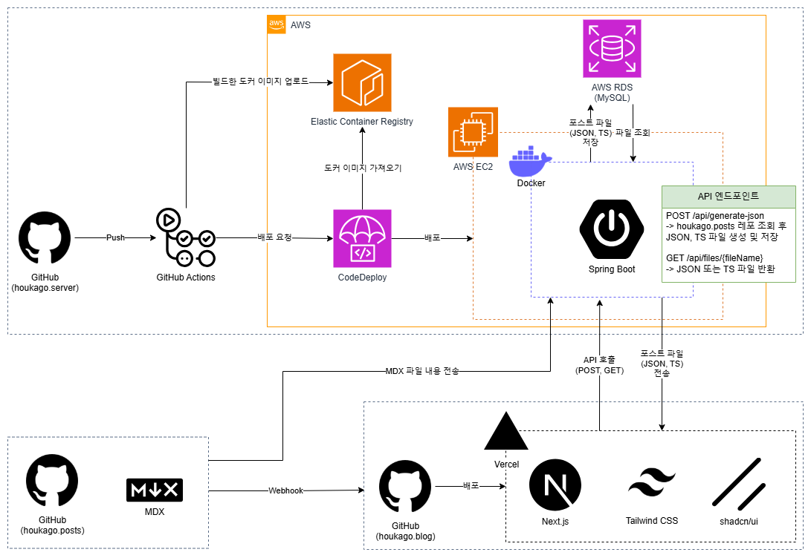

# houkago.server

---


> [방과후 블로그](https://github.com/HOKAGO-MEMORIES/houkago.blog)를 위한 백엔드 서버입니다.


## 아키텍처 다이어그램
  

<details>
<summary>환경변수 설정</summary>

## .env 파일  

```
# API
GITHUB_API_URL=https://api.github.com/repos/(본인 레포)
GITHUB_IMAGE_URL=https://raw.githubusercontent.com/(본인 레포)
GITHUB_TOKEN=(본인 토큰)
ALLOWED_ORIGINS=(주소 입력 쉼표(,)로 구분)

# Database
DATABASE_URL=jdbc:(데이터베이스 유형)://(호스트):(포트)/(데이터베이스 이름)
DATABASE_USERNAME=(데이터베이스 계정)
DATABASE_PASSWORD=(데이터베이스 계정 비밀번호)

# start.sh
AWS_ACCOUNT_ID=(본인 AWS 계정 ID)
```

## GitHub Action Secrets  
```
AWS_ACCESS_KEY_ID=(IAM 사용자 엑세스 키 ID)
AWS_ACCOUNT_ID=(본인 AWS 계정 ID)
AWS_SECRET_ACCESS_KEY=(IAM 사용자 비밀 엑세스 키)
CODEDEPLOY_APP_NAME=(CodeDeploy 애플리케이션)
CODEDEPLOY_GROUP_NAME=(CodeDeploy 배포 그룹)
```
</details>